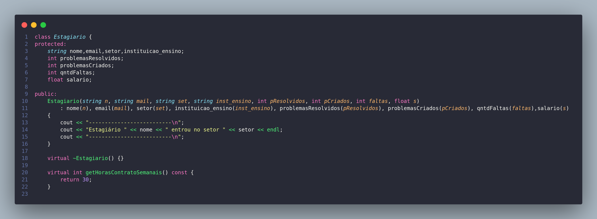
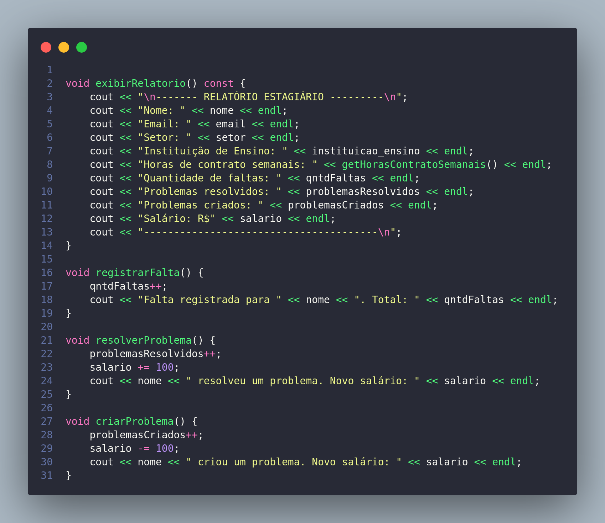
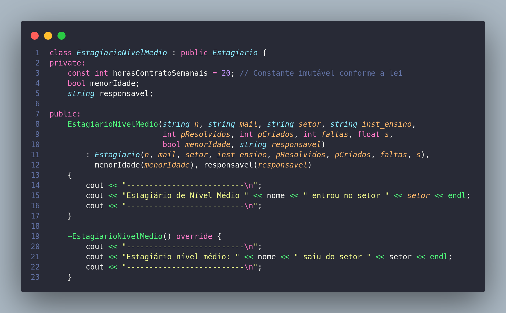
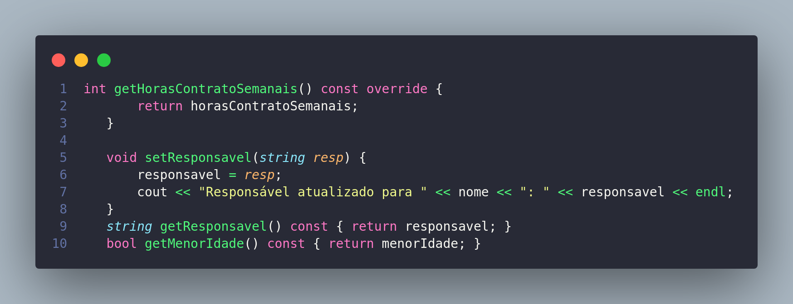
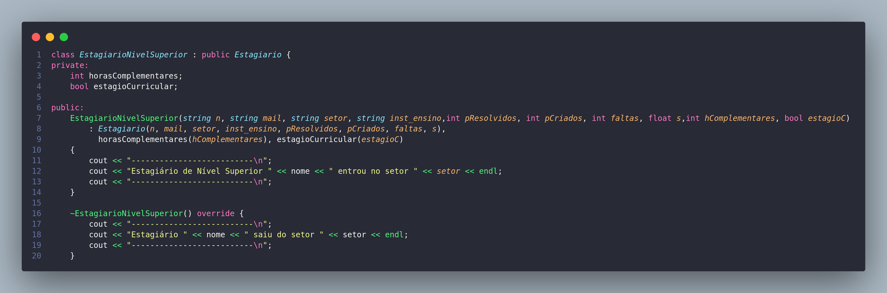
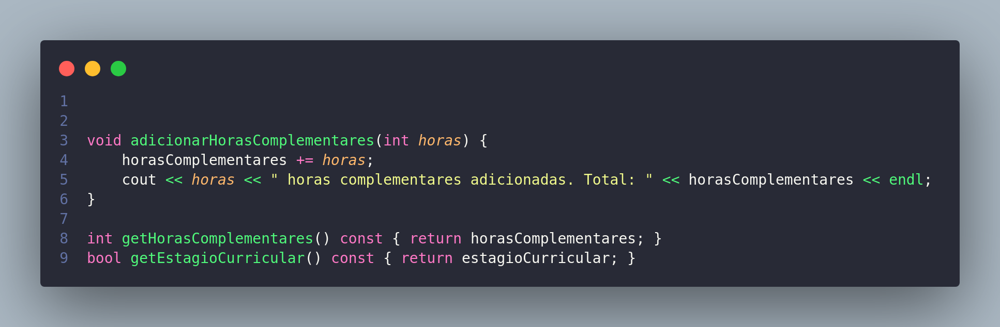
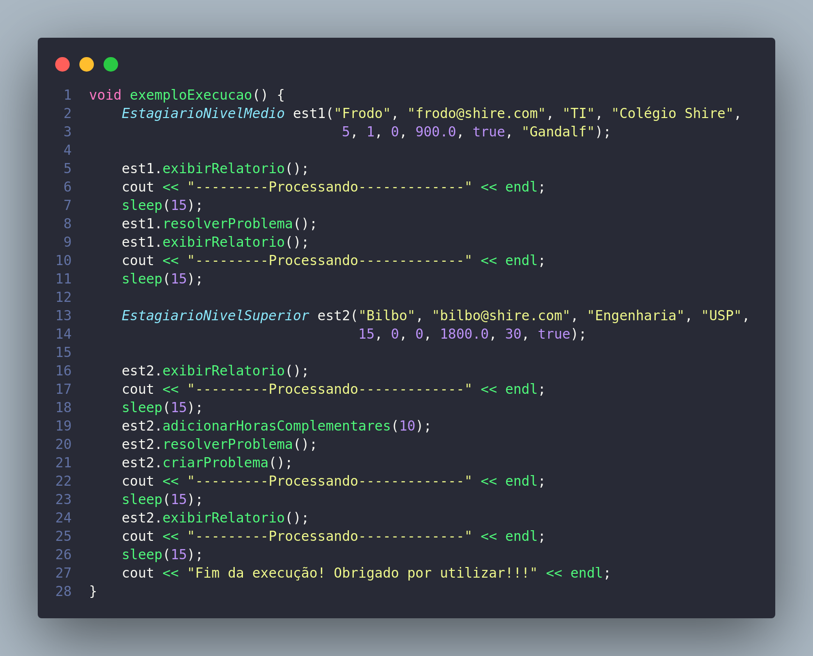
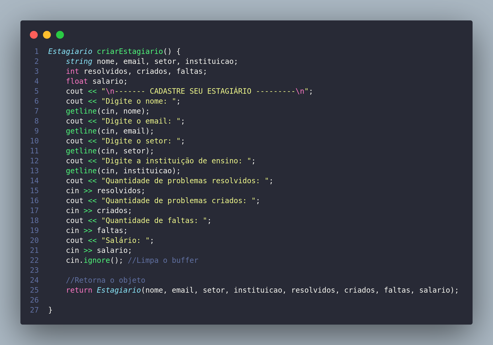

# Documentação Classe Estagiario
## Classe base

## Metódos bases

## Subclasse EstagiarioNivelMedio

## Metódos exclusivos da subclasse Estagiário Médio

## Subclasse EstagiarioNivelSuperior

## Metódos exclusivos da subclasse Estagiário Superior

## Exemplos de Execução

## Exemplos de Entrada de dados

